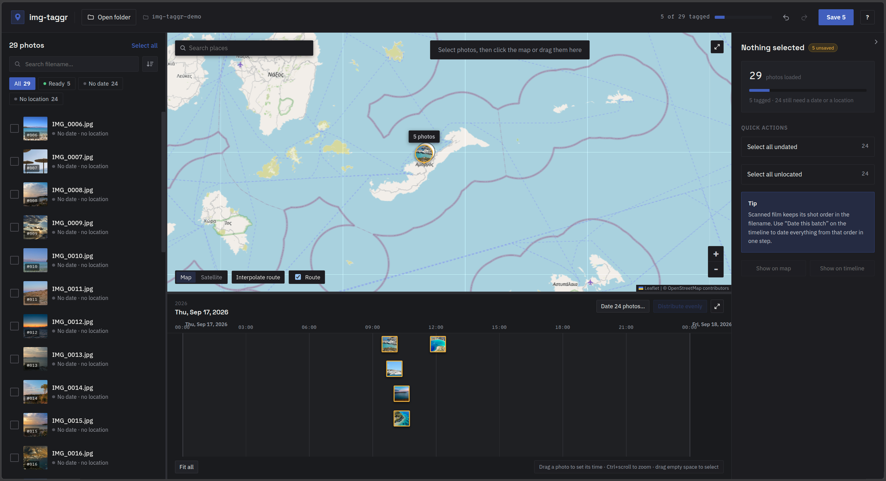
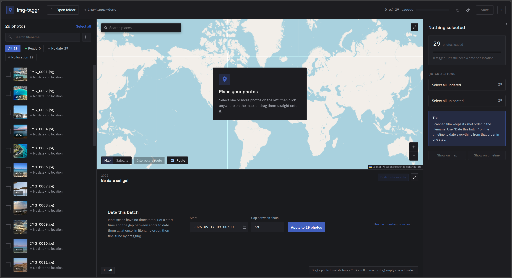

# img-taggr - Image location and time metadata editor

**img-taggr** is an image **time, date and location** metadata editor, available
as a static site or a standalone desktop app. Set the date and location of your images by placing
them on an interactive map and a timeline, which makes tagging a whole folder
at once quick.

**[Try it in your browser](https://julespatmanidis.github.io/img_taggr/)** (no
install, no upload, the photos stay on your machine)



## Formats

| Format | Read | Write | Thumbnail (desktop) | Thumbnail (web) |
|---|---|---|---|---|
| JPEG, PNG | yes | yes | yes | yes |
| WebP, lossless or extended | yes | yes | yes | yes |
| WebP, simple lossy (`VP8 `) | no | no | no | no |
| TIFF | yes | yes | yes | no |
| HEIC/HEIF | yes | yes | no | Safari only |
| RAW | no | no | no | no |

RAW files and simple-format lossy WebP are not supported and skipped at import.

## Quickstart

### Web

This repository includes an already compiled backend for the app in
WebAssembly, so running it needs nothing but Python to serve it locally:

```
./dev-server.py      # serves app/ on http://localhost:8080
```

Use this script rather than `python3 -m http.server`. The stock server sends no
cache headers so after edits to the source code the browser might use a stale cached file.

To rebuild the engine after changing the Rust code you need
[Rust](https://rustup.rs) and [Node](https://nodejs.org):

```
rustup target add wasm32-unknown-unknown
cargo install wasm-bindgen-cli --version 0.2.128

npm run web          # rebuilds the wasm, then serves app/
```

To deploy, publish `app/` as static files. There is no server side. The
included GitHub Actions workflow does exactly that on every push to `main`.

### Desktop

Linux only so far. macOS and Windows are not tested, and reports are welcome.
Nothing to install at runtime, since the metadata engine is compiled in.
Building needs [Rust](https://rustup.rs), [Node](https://nodejs.org) and the
Tauri system libraries:

```
sudo dnf install webkit2gtk4.1-devel libsoup3-devel \
                 librsvg2-devel libappindicator-gtk3-devel
npm install
npm run dev          # development window
npm run build        # .deb / .rpm / AppImage in desktop/target/release/bundle
```

Debian/Ubuntu: `libwebkit2gtk-4.1-dev`, `libsoup-3.0-dev`, `librsvg2-dev`.

## Features

**Map.** Photos with coordinates appear as pins, joined by a dashed route in
time order. Nearby pins merge into a numbered cluster, and photos sitting on
the very same spot fan out when you click them.

- Click and place, or drag and drop images on the map to set their latitude and longitude.
- Select multiple images from the list to place them in bulk.
- Drag placed images to move them. If an image belongs to a multi-photo selection, the whole
  selection moves together, keeping its shape.
- Search for a place to move the map-view there.
- Switch between the street map and satellite imagery.
- **Interpolate route** positions un-placed photos along the line between placed
  ones, using their timestamps. Place the first and last shot of a walk and the
  rest fall into place. Photos outside the placed time range are left alone and
  reported, never guessed at. This is experimental.

**Timeline.** One continuous track across the whole set, with day boundaries
marked. Scroll to pan, Ctrl+scroll (or pinch) to zoom, **Fit all** to see
everything.

- Drag a photo to set its time.
- With several photos selected **they all shift by the same amount**, so the
  intervals between shots stay as they were. Hold **Alt** to move one photo out
  of formation.
- Drag across empty track to select the photos inside a box.
- Drop undated photos from the list to date them.
- **Distribute evenly** spaces the selected photos at equal intervals between
  the first and the last, which untangles a burst dropped on one spot.

The **Date this batch** option after importing images takes a start time and one
interval and dates everything still undated, in filename order.



## Editing model

Wall-clock time and UTC offset are **separate fields**.

The inspector on the right edits the selection in place. Date and time are one
`YYYY-MM-DD HH:MM:SS` field. On a mixed selection, changing only the date leaves
each photo its own time. **Shift by** takes `+3h47m`, `-15s` or `-0:15` and
moves every selected photo.

Tags written: `DateTimeOriginal`, `CreateDate`, `ModifyDate`, `OffsetTime*`, and
`GPSLatitude`/`GPSLongitude` with their hemisphere refs. Every other tag is left
as it was, with two exceptions. 

TIFF also gets `XResolution`, `YResolution` and
`ResolutionUnit`, which it will not write without. And if a file's existing EXIF
block cannot be parsed at all, which is common in scanner output, it is replaced
with a fresh one rather than the file being refused, so that file keeps only the
tags listed above.

## Saving

The app stages every change in memory and writes nothing until you press
**Save**. Amber dots show what is still pending. You can undo with Ctrl+Z to unwind anything
not yet written.

Tagged files are written as a new set into a folder, and the originals are never opened for writing.

Only the photos you changed are written. Unedited ones stay where they are.

Browsers without the File System Access API (Firefox, Safari) cannot write to a
folder at all, so they download a ZIP instead (the app detects this and relabels
the field accordingly).

## Privacy

Photos are read locally and never uploaded. There is no server, no account and
no telemetry, in either build.

The place search box sends what you type to [photon.komoot.io](https://photon.komoot.io) to turn it into coordinates.

Map tiles are fetched from their providers as you pan.

## Keyboard

| Key | Action |
|---|---|
| `Space` | preview the selected photo (`←` `→` step, `Esc` closes) |
| double-click | show a photo in the other view |
| `M` / `T` | enlarge the map / the timeline |
| `Ctrl+Z` / `Ctrl+Shift+Z` | undo / redo |
| `↑` `↓` in the photo list | select next (`Shift` extends, `Ctrl` only moves, `Ctrl+Space` toggles) |
| `Ctrl+A` | select every photo the list shows |
| `Delete` | take the selected photos out of the list |
| `Ctrl+S` | save |
| `←` `→` | shift selection 1 min (`Shift` = 10 s) |
| `Esc` | clear selection |
| click / `Shift`+click / `Ctrl`+click | select / range / toggle |
| `?` | list of shortcuts |

## Development

```
npm test             # frontend: state, undo journal, edit logic, save contract
npm run test:rust    # engine metadata handling, desktop output paths
```

The frontend tests run on Node, with no dependencies and no build step. See
[ARCHITECTURE.md](ARCHITECTURE.md) for the module map, the engine seam that lets
one codebase drive both targets, and the conventions worth knowing before
sending a patch.

Issues and pull requests are welcome, particularly build reports from macOS and
Windows.

## License

MIT. See [LICENSE](LICENSE).
